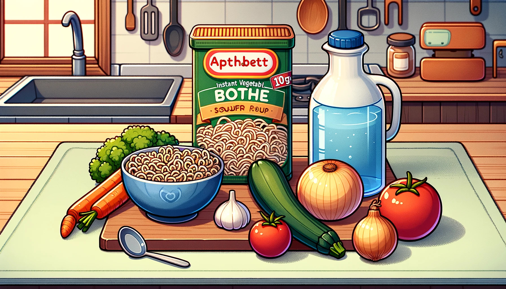
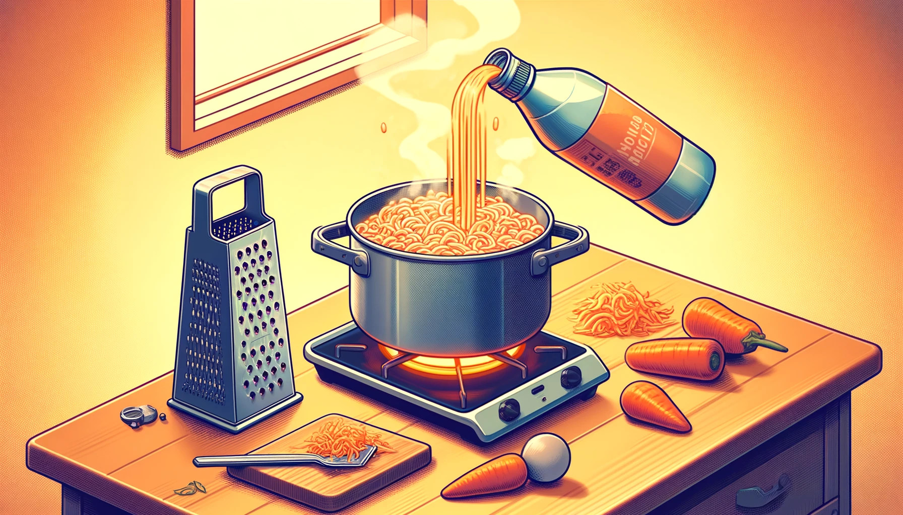
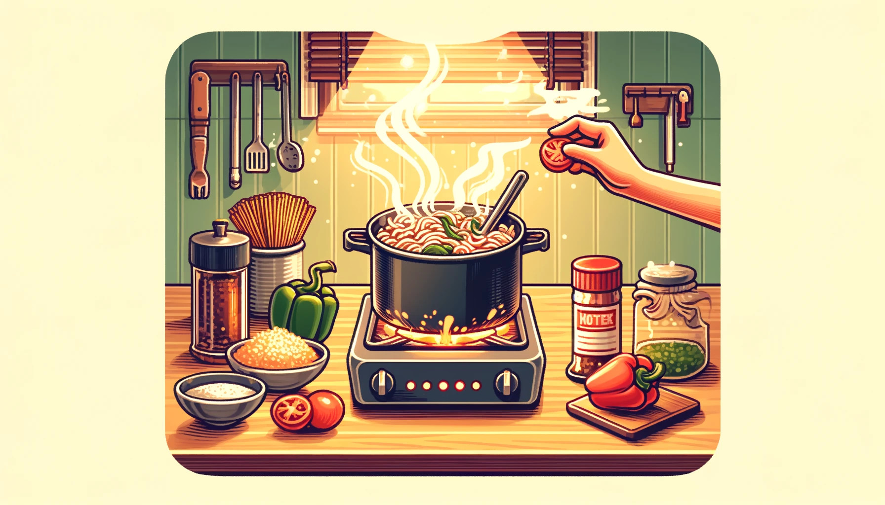

# LiaScript Cookbook - Alphabet Soup

A. Basics

Preparation / Working time: about 10 minutes / Cooking time: about 25 minutes

Total time: about 35 minutes

Chop the onions finely or cut them and then sweat them in a large pot with the olive oil. Then deglaze with the water and, as it begins to boil, grate the peeled carrots directly into the pot.
Once the water is boiling, stir in the broth. Cut the zucchini into cubes or halved slices and add them to the soup along with the noodles. Let it simmer for about 10 minutes and then add the finely chopped tomatoes and bell peppers.
If necessary, add some water. Let it simmer for another 10 minutes and season with spices, salt, and pepper.

A.1 Ingredient List

100 g Alphabet noodles
2 tsp, heaped Instant vegetable broth powder
1 liter Water, possibly a bit more
1 Zucchini
2 Red bell peppers
2 Carrots
1 Onion
3 Tomatoes
Possibly
Herbs, fresh, dried, or frozen
Salt and pepper
Sweet paprika powder
1 tbsp Olive oil

A.2 Tables and Quantities

Nutritional values per serving: kcal 160

Substance          Grams
Protein            6.31 g
Fat                2.75 g
Carbohydrates      26.48 g

A.3 Proper Citation

Alphabet soup is a noodle soup with alphabet noodles as an addition.
Often, small pieces of carrots and various spices are also added to the mix.
Alphabet noodles are up to one centimeter in size and shaped like the letters 'A–Z' and more rarely numbers '0–9' or the '@' symbol.
Alphabet noodles and alphabet soup have been available since at least 1867 in the United States and since at least 1884 in Germany.
Alphabet noodles are typically sold as a soup addition, and alphabet soups as packet soups or canned goods.

Wikipedia: https://de.wikipedia.org/wiki/Buchstabensuppe 

B. External References

Source: https://www.chefkoch.de/rezepte/2166951347805623/Buchstabensuppe-mit-frischem-Gemuese.html

B.1 Pictures

https://upload.wikimedia.org/wikipedia/commons/0/09/Buchstabensuppe.jpg

https://www.verbformen.de/deklination/substantive/Buchstabensuppe.png

https://upload.wikimedia.org/wikipedia/commons/e/e9/Alphabet_soup%2C_empty.jpg

B.2 Music for Cooking

https://open.spotify.com/track/24fdXLWNsc6LJZrbE8wLaJ

https://soundcloud.com/sitzhupe/barbier-von-sevillia

B.3 Cooking Videos

https://www.youtube.com/watch?v=tstREgc4S5M

https://www.youtube.com/watch?v=U_UW69w0uHE

B.4 Augmented Reality and More

https://sketchfab.com/3d-models/formschussel-fur-terra-sigillata-schalen-d4a48496f8bc4808b22277fdedba0b2b

https://phet.colorado.edu/sims/html/states-of-matter/latest/states-of-matter_all.html

C. Recipe Formats

Interactive books, slides, presentations

C.1 Animations & Comments

Today we are cooking alphabet soup, and we need the following ingredients:

- 100 g Alphabet noodles
- 2 tsp, heaped Instant vegetable broth powder
- 1 liter Water, possibly a bit more
- 1 Zucchini
- 2 Red bell peppers
- 2 Carrots
- 1 Onion
- 3 Tomatoes

First, chop the onions finely and then sweat them in a large pot with the olive oil.

Then deglaze with water, and as it starts to boil, grate the peeled carrots directly into the pot.

When the water boils, stir in the broth.
Cut the zucchini into cubes or halved slices and add them along with the noodles to the soup.
Let it simmer for about 10 minutes.

Then add the finely chopped tomatoes and bell peppers.

https://www.youtube.com/watch?v=V6paiDYJmOo&autoplay=1&mute=1

D. Questions and Quizzes

E. Programmed Cooking

var Guests = 4
const Persons = 4

var Ingredient = {
    Alphabet noodles: 100, // grams
    Vegetable broth: 2, // tsp
    Water: 1, // L
    Zucchini: 1,
    Bell peppers: 2,
    Carrots: 2,
    Onions: 1,
    Tomatoes: 3,
    Oil: 1 // tbsp
}

for (const Name in Ingredient) {
    Ingredient[Name] = (Ingredient[Name] / Persons) * Guests
}

JSON.stringify(Ingredient, null, 2)

F. Extensions of the Recipe

F.1 Own

F.2 Others

