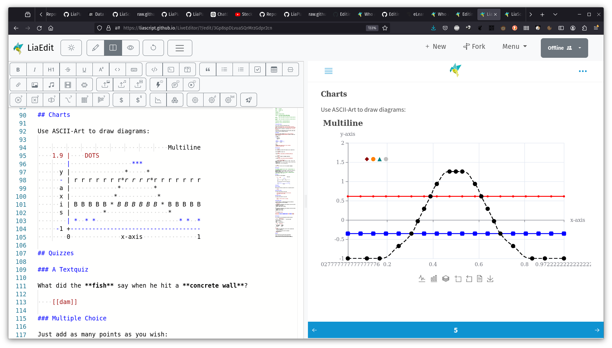
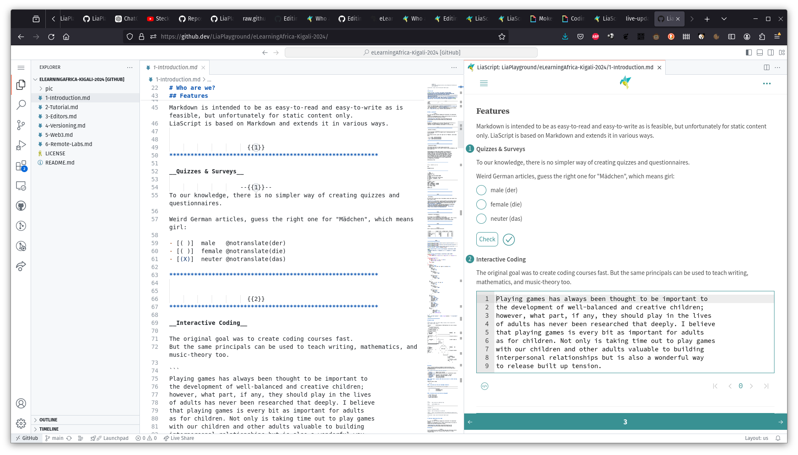
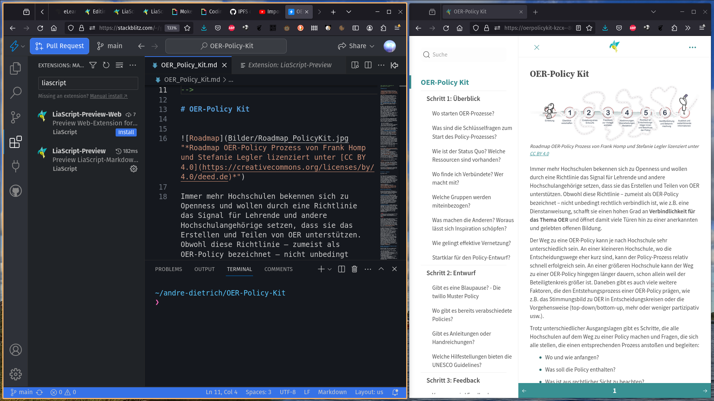

# Editing

<iframe src="https://giphy.com/embed/Ws6T5PN7wHv3cY8xy8" width="100%" height="100%" style="position:absolute" frameBorder="0" class="giphy-embed" allowFullScreen></iframe>

<a href="https://giphy.com/gifs/nounish-dao-nouns-noggles-Ws6T5PN7wHv3cY8xy8">via GIPHY</a>

## LiveEditor

https://liascript.github.io/LiveEditor/

## Texteditor

https://liascript.github.io/development-server/

Direct download: https://github.com/LiaScript/LiaScript-DevServer/releases

<!-- style="width: 100%"-->

## VSCode Extenstions

1. Desktop: https://liascript.github.io/vscode/
2. Web: https://liascript.github.io/vscode-web/

## Stackblitz

https://stackblitz.com

## Exporter to

- SCORM1.2
- SCROM2004
- IMS
- PDF
- Webpage
- Projects ...

https://liascript.github.io/exporter/

!?[Exporter example by Damien Belveze](https://www.youtube.com/watch?v=yk4uEqoKcpw)