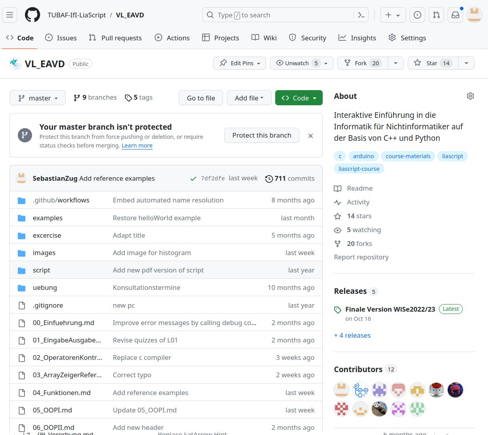
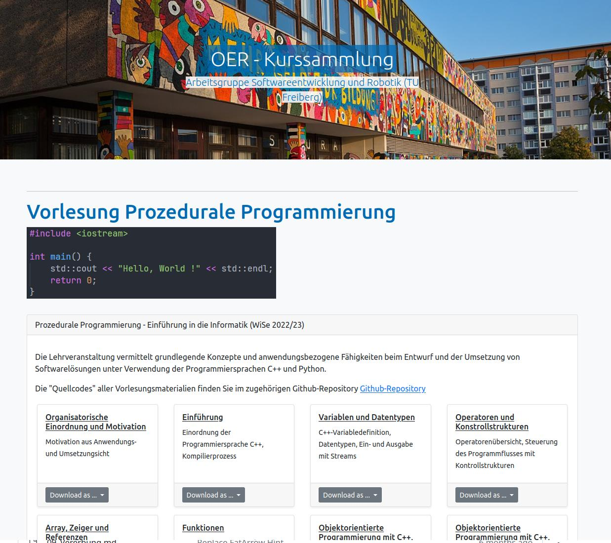
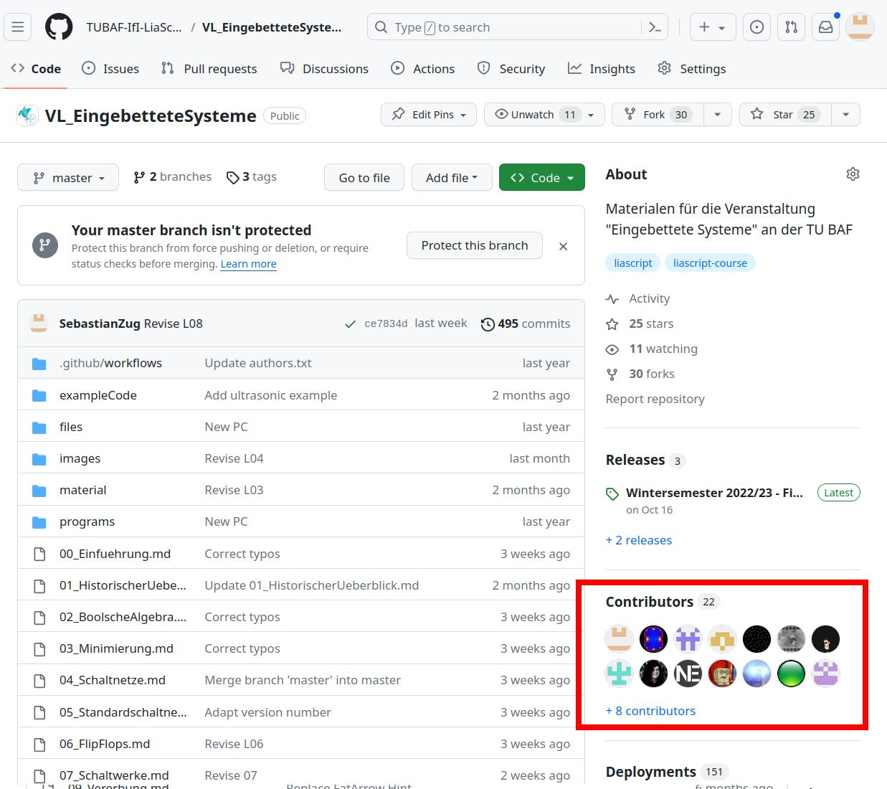

<!--

author:   Sebastian Zug, André Dietrich

import:   https://raw.githubusercontent.com/liaTemplates/ExplainGit/master/README.md
        
-->

[](https://liascript.github.io/course/?https://github.com/LiaPlayground/eLearningAfrica-Kigali-2024/blob/main/4-Versioning.md)

# Versioning

                       {{0-1}}
**************************************************

What did we learn so far?

1. We understand the general idea of a markup language and
2. We apply its concepts on interactive teaching content.
3. We learned how to use different editors.

**************************************************

                          {{1-2}}
**************************************************

What are the open questions?

> Challenge 1: __How to cooperate with other authors?__
>
> Challenge 2: __How to keep track of changes?__

**************************************************

                        {{2-3}}
**************************************************

>  **Open Courseware / Open Educational Resources** ... teaching, learning and
> research materials in any medium, digital or otherwise,that reside in the
> **public domain** or have been released under an open license that permits
> no-cost access, use, **adaptation** and **redistribution** by others with no or 4
> limited restrictions. Open licensing is built within the existing framework of
> intellectual property rights as defined by relevant international conventions
> and respects the authorship of the work
>
> -- UNESCO 2002 Forum on the Impact of Open Courseware for Higher Education in Developing Countries [(Link)](https://unesdoc.unesco.org/ark:/48223/pf0000128515)


**************************************************

                       {{4-6}}
**************************************************

https://en.wikipedia.org/wiki/Kigali

> How does Wikipedia succeeds?

+ Simple context description language
+ Integrated editor
+ Versioning method
+ ...

**************************************************

                       {{5-6}}
**************************************************

> But of course, we cannot map the Wikipedia concept 1:1 to learning content!

Course content ...

+ ... is not only text, but also includes animations, videos, and interactive elements.
+ ... depends on specific learning goals and the didactic concept of the teacher.
+ ... has to be iterated in a learning management system mostly.

> Can we transfer the ideas of versioning on our LiaScript content?

**************************************************

## Motivation and concepts

> How software developers work together on a open source project project?

The use a versioning system that allows them to:

+ identify indivdual changes 
+ merge changes from different authors
+ revert to previous versions
+ ...


``` text @ExplainGit.eval
git commit -m V1
git commit -m V2
git commit -m V3
```


{{1-2}}
```ascii
                     local                           remote
  ---------------------------------------------  --------------
      Working     "Staging"         Local          Remote
      copy                        Repository      Repository
                       |               |                 |
                       |               |    git clone    |
                       |               |<----------------|
       +-+- - - - - - -|- - - - - - - -|                 |
       | | Changes     |               |                 |
       | |             |               |                 |
       +-+             |               |                 |
        |   git add    |               |                 |
        |------------->|  git commit   |                 |
        |              |-------------->|                 |
       +-+             |               |                 |
       | | additional  |               |                 |
       | | changes     |               |                 |
       +-+             |               |                 |
        |   git add    |               |                 |
        +------------->|  git commit   |                 |
                       |-------------->|   git push      |
                       |               |---------------->|
                       |               |                 |                     .
```


{{2-3}}
> Puhh, that looks complicated, but it is not that hard to use. Let's plug a website in front of the git mechanisms.

## Usage of Github

Live Demonstration

https://github.com/SebastianZug/Kigali_Github_Tutorial

## Liascript & Experiences


Starting in 2018 we switched the learning content of our [courses](https://github.com/TUBAF-IfI-LiaScript) completely to LiaScript.

!?[](https://github.com/LiaPlayground/LiaScript-User-Symposium-2023/raw/main/vid/TUBAF.mp4)

> __I am going to summarize my experiences and usage patterns in this talk.__

### Editing 

+ LiaScript online editor
+ offline editor in Visual Studio Code 



https://github.com/TUBAF-IfI-LiaScript/VL_EAVD

### Dissemination

+ github
+ separate website via Lia exporter



https://github.com/TUBAF-IfI-LiaScript/TUBAF-IfI-LiaScript.github.io

https://tubaf-ifi-liascript.github.io/prozprog.html

### Student feedbacks 

> Students love to correct the professor.



https://github.com/TUBAF-IfI-LiaScript/VL_EingebetteteSysteme/pulls?q=is%3Apr+is%3Aclosed